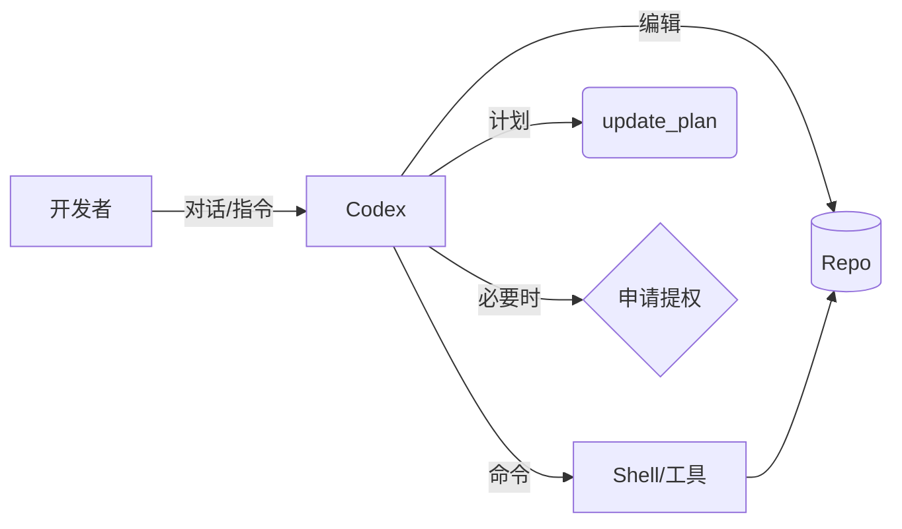

# Codex 介绍与使用指南

> 本文面向在本仓库中与 Codex（OpenAI 领导的开源终端式智能编码助手）协作的开发者，帮助你快速上手、理解工作方式与最佳实践。

## 什么是 Codex？
Codex 是一个在本地仓库中工作的“结对编程”助手：它能阅读/修改代码、运行命令、生成计划、撰写文档，并在需要时请求你授权以执行更高权限的操作。你与它的对话就是工作流本身。

- 形态：终端内的智能助手（支持多工具与插件）
- 能力：分析代码、编辑文件、生成/更新文档、运行脚本与测试、起草变更计划
- 优先级：追求“正确、小步、可验证”的改动；默认不擅自提交代码

## 适用场景
- 撰写或重组文档（如本文件）、README、变更说明
- 小到中的代码改动：修复、重构、脚手架搭建
- 分析错误日志、补充测试、改良开发体验
- 以“计划→执行→验证”的节奏推进中大型任务

## 快速上手（推荐流程）
1) 明确目标：在对话中用 1–2 句话描述你要什么。
2) 需要多步骤时，请让 Codex 建立“计划”（`update_plan`）。
3) 执行改动：Codex 会在仓库内新增/修改文件，并在操作前简要说明。
4) 验证结果：必要时运行脚本/测试；较重命令会先提示再执行。
5) 复盘与提交：确认无误后，你可让 Codex 帮你暂存/提交/推送/发起 PR。

## 命令与权限
- 本地命令默认在受限沙箱内执行，写入范围限定在当前仓库。
- 当命令需要网络/系统级访问或可能带来破坏性影响时，Codex 会以“申请提权”的形式请你确认（带理由与可复用前缀规则）。
- 你可以拒绝或仅临时同意；同意后 Codex 才会继续。

## 文件编辑与规范
- 改动遵循“最小可行、聚焦任务、不牵涉无关变更”的原则。
- 文档与代码风格尽量延续仓库既有风格；若无既有规范，Codex 会给出简洁一致的默认风格。
- 大文件不内联粘贴到对话里，只在消息中指明文件路径与要点。

## 计划（Planning）
- 对多步骤任务，Codex 会用 `update_plan` 维护一份短计划，标注 `pending / in_progress / completed`。
- 你可随时要求调整计划顺序或范围。

## Git 协作
- 分支：默认使用 `codex/` 前缀的新分支（如需要也可在指令中指定）。
- 提交：只有在你同意时，Codex 才会执行 `git add/commit/push` 等操作。
- PR：可生成草稿或正式 PR，并在消息中返回链接。

## 最佳实践
- 明确界面：告诉 Codex 你希望“只改 X”或“同时改 X 和测试”。
- 约束输出：指定目标文件/目录、语言、风格或范式（例如 API 接口约定）。
- 小步验证：让 Codex 先完成最关键的 1–2 步，再继续展开。
- 暂停点：任何时候可让 Codex“先到这一步”，便于你本地验证。

## 常见问答（FAQ）
- Q：Codex 会自动上网查资料吗？
  - A：除非你要求或任务确需最新资料，Codex 优先使用本地上下文；需要联网时会明确说明并引用来源。
- Q：如何让它提交变更？
  - A：直接说“帮我提交并推送”，或指定分支/提交信息；Codex 会先确认再执行。
- Q：能否只让它写文档、不动代码？
  - A：可以，在需求里写明“仅文档”。

## 本文档维护
- 位置：`docs/codex-intro.md`
- 建议：随仓库工作流程演进而更新（添加你的团队约定、脚本命令、测试规范等）。

—— 文档由 Codex 于 2026‑06‑15 生成
